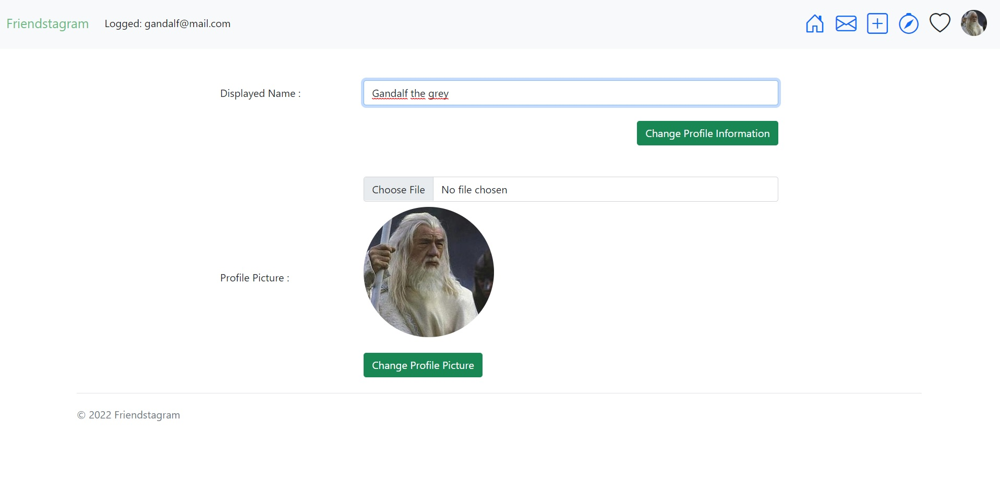
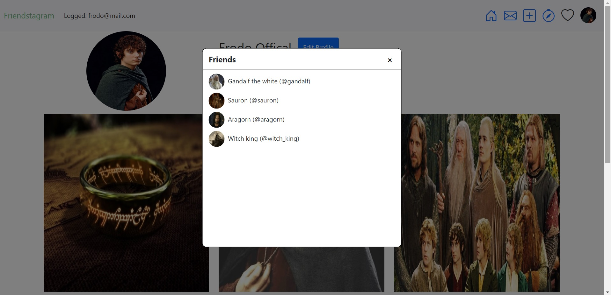

# Friendstagram - Social Network Application

## About

Friendstagram is social network application inspired by Instagram.  
Friendstagram have feature :  
* Login system
* Sharing images with friends
* Adding other user as friend
* Comment to sharings
* Messaging with other users
* Personal profile page for users

Application have .Net 5 Web Api at back-end side, 
Angular 13 at front-end side. 
Using Mssql as database, using Entity Framework for interact with database.


### Register


### Main Page


### Comments


### Profile


### Profile Edit


### Message


### Share


### Friendship




### Database Diagram


## Installation

Change Mssql connection string from appsettings.json file.

```
"ConnectionStrings": {  
    "Mssql": "Server=ChangeHere;Database=SocialNetworkDatabase;Trusted_Connection=True;"
},
```

Open package manager console and write

```
update-database
```

Back-end side is ready to run.
<br><br>

For front-end side. Navigate to "FriendstagramClient" 
and type npm install at terminal.

```
npm install
```
After installation completed, type ng serve at terminal for run client.
```
ng serve
```

Run both api and client. Application is ready. 


